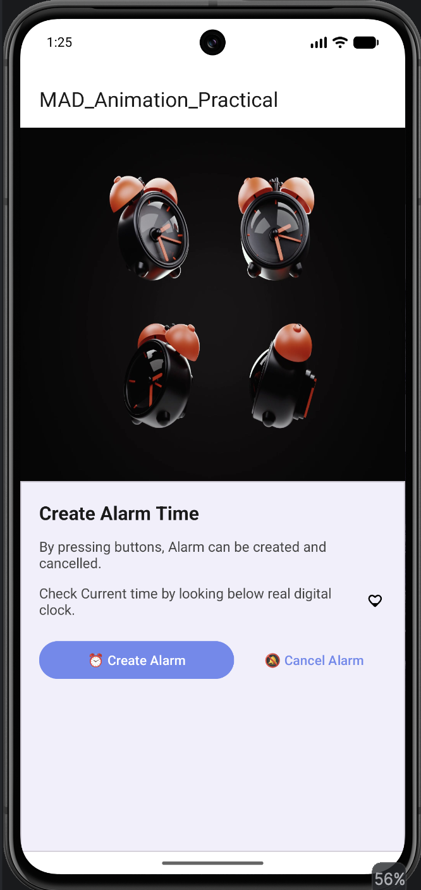

# Practical-6

---

**Aim:** To implement different types of animations in Android using Frame Animation and Tween Animation.

## 🔗 Project Description

This application demonstrates the implementation of different Android animations using **Kotlin and XML**. The application contains an animated **Splash Screen** followed by the **Main Activity**.

The Splash Screen uses **Frame Animation** and **Tween Animation**, including translate, rotate, and scale effects. After the splash animation is completed, the application automatically navigates to the Main Activity.

The Main Activity displays an animated alarm image and a heart pulse animation along with options to create or cancel an alarm.

## Key Components:

- **SplashActivity:** The first screen displayed when the application starts. It shows an animated logo using Frame Animation and Tween Animation. After the animation ends, it navigates to `MainActivity`.

- **MainActivity:** The main screen of the application. It displays the animated alarm, information card, heart animation, and buttons for creating and cancelling an alarm.

- **Frame Animation:** Uses `AnimationDrawable` to display multiple drawable frames sequentially, creating an animation effect.

- **Tween Animation:** Uses XML animation resources to change the properties of a view over time.

- **Translate Animation:** Moves the logo from one position to another during the splash animation.

- **Rotate Animation:** Rotates the logo from `0°` to `360°`.

- **Scale Animation:** Changes the size of the logo and is also used to create the heart pulse effect.

- **AnimationListener:** Detects animation events such as start, end, and repeat. When the splash animation ends, `onAnimationEnd()` is called to open `MainActivity`.

- **ConstraintLayout:** Used to create a responsive and flexible user interface.

- **MaterialCardView:** Used to display the information section in a structured Material Design card.

## Screenshots

| Splash Screen | Main Activity |
|---|---|
|  |  |

Enrollment No: 24012011080
Last Updated: August 27, 2026
